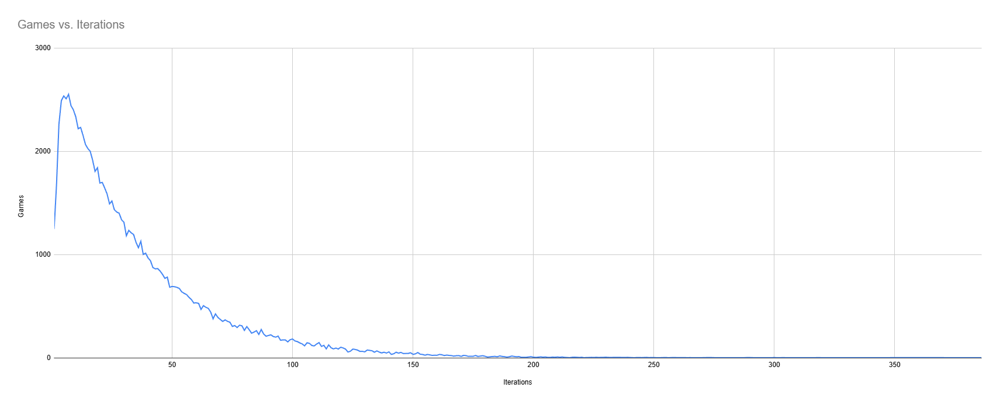

# Hand Solitaire Simulator

Hand Solitaire is single-player game for passing time when all you have is a deck of playing cards.  Apart from the cards, all it requires is two hands and a place to stash a discard pile, so it's ideal for road trips, waiting in long lines, etc.

This repo simulates many games and computes a histogram of how many iterations are required to win.

## Setup & Rules

1. Start by removing any jokers and shuffling the deck.
2. Hold the deck in your off hand with all cards face-down.
3. Draw the card on the bottom of the deck and place it face-up on top of the deck, slightly to the side so you can see the card underneath.
4. If there are at least 4 face-up cards and the first and fourth card have the same value (A23456789TJQK) then take those cards and the two cards between them and place them face-up on the discard pile.
5. If there are at least 4 face-up cards and the first and fourth card have the same suit, remove the two cards between them, but leave the suited cards in the hand.  Place the two removed cards face-up on the discard pile, then go back to step 4.
6. Return to step 3 until all of the face-down cards have been revealed.
7. Continue drawing face-up cards from the bottom of the hand to see if they trigger any discards at the top of the hand.  If you've drawn at least 3 face-up cards in a row without being able to discard, no further discards will be possible.
8. If all cards have been placed in the discard pile, you've won!  Otherwise you have completed one "iteration."  Shuffle the remaining cards in your hand, then place them on the *bottom* of the discard pile.  Flip the discard pile over and go back to step 2.

## Statistics

* The chance of winning on the first iteration is approximately 1.3%
* The chance of winning within 10 iterations or less is approximately 22.5%
* The chance of winning within 25 iterations of less is approximately 51%
* There is no upper limit to the number of iterations that might be required to win, since the shuffle in step 8 does not guarantee that an "unvisited" permutation is selected, but after simulating several million games, I have only seen one winning game that required over 500 iterations.
* It is possible to get stuck in a "loop" where it is impossible to win, though the chance is only about 0.06%.  This happens when there are very few cards remaining at the end of an iteration, and all permutations of decks to start the next iteration also yield a small number of cards remaining, and so on recursively, where the set of "reachable" decks is small and does not contain any winning decks.
* The shuffling of remaining cards in step 8 is very important!  If you omit this, then approximately half of all starting decks can never win.

Here is a histogram of 1,000,000 random games:

